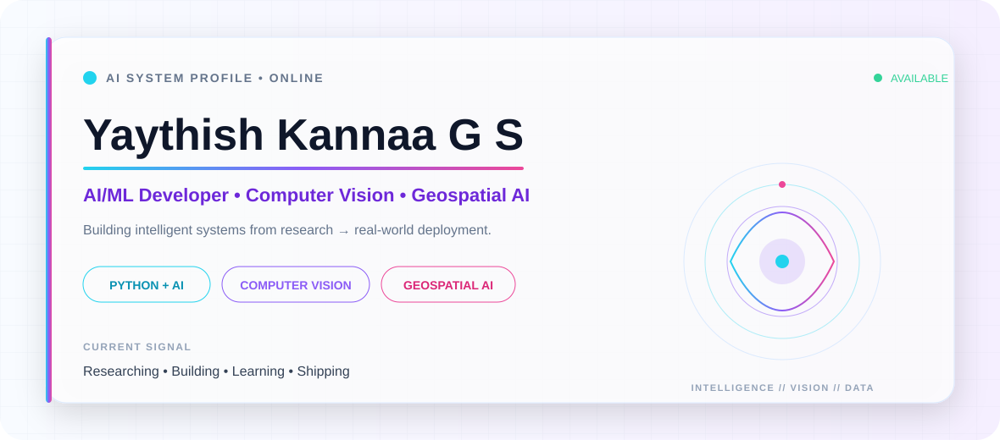

<picture>
  <source media="(prefers-color-scheme: dark)" srcset="./assets/banner-dark.svg">
  <source media="(prefers-color-scheme: light)" srcset="./assets/banner-light.svg">
  
</picture>

<div align="center">

### AI/ML Developer • Computer Vision • Geospatial Intelligence

Building intelligent systems that connect **AI, vision, data, and real-world applications**.

[](https://github.com/Yaythish2462)
[](https://github.com/Yaythish2462?tab=followers)

</div>

---

## 👨‍💻 About Me

- 🤖 Focused on **Artificial Intelligence, Machine Learning & Deep Learning**
- 👁️ Building **Computer Vision** and real-time intelligent applications
- 🗺️ Exploring **GIS, Remote Sensing & Geospatial Machine Learning**
- 📊 Working with data-driven modelling, prediction and visualization
- ⚡ Interested in deploying AI solutions on **edge computing platforms**
- 🧠 Always experimenting with new models, tools and research ideas

## 🧰 Tech Stack

<div align="center">

### Languages


### AI • ML • Computer Vision


### Development • Deployment


</div>

## 🚀 What I Build

<table>
<tr>
<td width="50%" valign="top">

### 🩺 AI for Vital Signs
Computer-vision pipelines for contactless physiological measurement, real-time signal processing and edge-AI deployment.

</td>
<td width="50%" valign="top">

### 🌍 Geospatial AI
Machine-learning workflows combining geological, geophysical, geochemical and remote-sensing data for spatial prediction.

</td>
</tr>
<tr>
<td width="50%" valign="top">

### 👁️ Computer Vision
Face landmarks, ROI tracking, video processing, signal extraction and intelligent camera-based applications.

</td>
<td width="50%" valign="top">

### 🧠 Machine Learning
Regression, classification, CNNs, Random Forest, XGBoost, SVM and model evaluation for applied research.

</td>
</tr>
</table>

## 📊 GitHub Dashboard

<div align="center">


</div>

## 📈 Contribution Activity

<div align="center">

[](https://github.com/Yaythish2462)

</div>

## 🎯 Current Focus

```text
AI / ML              ███████████████████░   Applied Intelligence
Computer Vision      ██████████████████░░   Real-time Vision
Geospatial AI        █████████████████░░░   Spatial Prediction
Edge AI              ████████████████░░░░   NVIDIA / Embedded AI
Research             ███████████████████░   Experiment → Deploy
```

## 🤝 Let's Connect

<div align="center">

**Open to collaboration on AI/ML, Computer Vision, Geospatial AI and research-driven projects.**

[](https://github.com/Yaythish2462)

<br/>

### “Turning data into intelligence, and intelligence into impact.”

</div>

---

<div align="center">
<sub>Designed with ❤️ for AI, research and open-source development.</sub>
</div>
